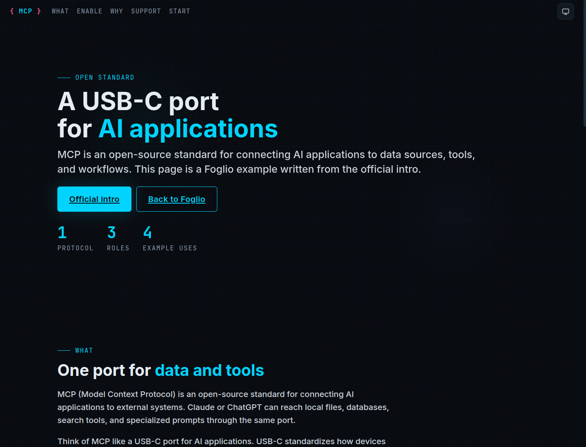

# Foglio

A foglio is the sheet. This kit is that sheet: one HTML file an LLM can fill without rewriting the CSS.

Live page: [alessandroannini.github.io/foglio](https://alessandroannini.github.io/foglio/)

```
npx skills add AlessandroAnnini/foglio
```

Listing: [skills.sh/AlessandroAnnini/foglio](https://skills.sh/AlessandroAnnini/foglio). Skill page: [foglio](https://skills.sh/AlessandroAnnini/foglio/foglio).

Then say: Document this with Foglio. In Cursor, attach `@foglio`. The skill loads only when you name Foglio.

One HTML file. No build. Fonts and Mermaid load from CDNs.

Example: [MCP documented with Foglio](https://alessandroannini.github.io/foglio/mcp.html).

[](https://alessandroannini.github.io/foglio/mcp.html)

Works for specifications, procedures, meeting notes, use-case maps, training, runbooks, API notes, and research summaries. Copy [skeleton.html](skeleton.html) to write a page. The rules sit in [RECIPE.md](RECIPE.md). [catalog.html](catalog.html) is a catalog of allowed blocks, not a required table of contents. The outline comes from your source.

## Features

- Locked chrome. Copy the skeleton and fill `llm-slot` regions only. CSS, theme menu, dialog, and runtime stay byte-identical.
- Any outline. Sections come from the source, not from the specimen.
- A closed block catalog: hero, section, cards, badges, callouts, tables, prose, buttons, Mermaid, SVG flow.
- Three themes: light, dark, and system (the default). Choice persists in `html-docs-theme`.
- Writing rules in the recipe: ASCII source, no AI filler, body text first.
- Installable skill. `npx skills add AlessandroAnnini/foglio`, then name Foglio.

## Contents

| File | Role |
|---|---|
| [index.html](index.html) | Project page (GitHub Pages) |
| [mcp.html](mcp.html) | Worked example (MCP intro) |
| [catalog.html](catalog.html) | Specimen and visual catalog |
| [skeleton.html](skeleton.html) | Start file: frozen chrome, empty slots |
| [RECIPE.md](RECIPE.md) | Protocol, writing rules, tokens, catalog |
| [skills/foglio](skills/foglio/SKILL.md) | Installable agent skill |
| [llms.txt](llms.txt) | Index for language models |
| [LICENSE](LICENSE) | MIT |
| [CONTRIBUTING.md](CONTRIBUTING.md) | How to change the kit |

## Getting started

Install the skill, then name Foglio. The agent copies `skeleton.html`, fills slots, and stops.

Without the skill, attach `RECIPE.md` and `skeleton.html` first, put your notes last, and ask for a filesystem copy of the skeleton to an output path. Do not ask the model to write CSS.

Host-specific notes and the prompt shape are on the live page: [Getting started](https://alessandroannini.github.io/foglio/#start). Writing rules sit in [RECIPE.md](RECIPE.md).

After it stops, check that `#nav-links` and `#sec-select` match every `section[id]`. If chrome drifted, restore frozen blocks from the skeleton.

## GitHub

Repository: [github.com/AlessandroAnnini/foglio](https://github.com/AlessandroAnnini/foglio)

Project page: [alessandroannini.github.io/foglio](https://alessandroannini.github.io/foglio/)

Skill listing: [skills.sh/AlessandroAnnini/foglio](https://skills.sh/AlessandroAnnini/foglio)

## License

MIT. Copyright Alessandro Filippo Annini. See [LICENSE](LICENSE).
