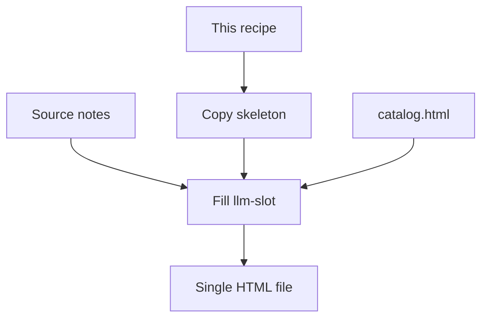

# Foglio

Self-contained. Use this folder only.

Foglio produces one HTML file for any documentation: specifications, procedures, meeting notes, use-case maps, training, runbooks, API notes, research summaries, or a design specimen. The outline comes from the source material. [catalog.html](catalog.html) is a catalog of allowed blocks, not a required table of contents. [index.html](index.html) is this project's own page.

Generate from this file plus [skeleton.html](skeleton.html). The painted contract is [catalog.html](catalog.html). Index: [llms.txt](llms.txt).



---

<protocol>
## Protocol (do this, in order)

1. Read the source and name the document type (spec, procedure, notes, map, training, runbook, or other). Choose section ids and labels from that material. Do not copy the specimen's Surfaces / Palette / Components outline unless you are writing a design-system page.
2. Copy `skeleton.html` to the output path. Use a filesystem copy. Do not retype `<style>`, boot script, theme menu, dialog, or runtime script.
3. Set `html lang` to the document language (`it`, `en`, or other). Fill only `<!-- llm-slot:... -->` regions. Keep every `<!-- llm-frozen:... -->` region byte-identical to the skeleton.
4. Write slot HTML with the catalog below. Use only the blocks the document needs. Omit hero CTAs, stats, flow, and Mermaid when the source has no use for them.
5. Sync `#nav-links` and `#sec-select` with every `section[id]`, same order, same labels. Never id a section `mermaid`. Use `diagrams` if the page has Mermaid.
6. Apply the writing rules in this file to every title, label, heading, paragraph, table cell, caption, aria-label, and diagram note.
7. Stop. Do not restyle, minify, or rewrite frozen chrome.

Output budget: slots only. Chrome is already correct.
</protocol>

<writing>
## Writing

These rules apply to the HTML you write and to any markdown or comments you add. They apply in every language.

### Characters

Type only characters that exist on a standard US or Italian keyboard.

| Avoid | Code | Use instead |
|---|---|---|
| em dash | U+2014 | comma, parentheses, or a rewritten sentence |
| en dash | U+2013 | hyphen, or the word "to" |
| arrows | U+2190 to U+2193, U+21D2 | `->` or `=>` inside code only |
| curly double quotes | U+201C U+201D | straight `"` |
| curly single quotes | U+2018 U+2019 | straight `'` |
| ellipsis | U+2026 | three dots `...`, or finish the sentence |
| typographic bullet | U+2022 | `-` in plain text, `*` in markdown |
| multiplication sign | U+00D7 | `x` or `*` |
| check / cross | U+2713 U+2717 | yes/no or `[x]` / `[ ]` |

Inside fenced code, `->` and `=>` are fine. Unicode math or subscript is allowed inside code or LaTeX only.

### Word choice

Do not use magic adverbs: quietly, deeply, fundamentally, remarkably, arguably.

Do not use hollow AI verbs and adjectives: delve, certainly, utilize, leverage (as a verb), robust, streamline, harness.

Do not use ornate filler nouns: tapestry, landscape, paradigm, synergy, ecosystem, framework (when you mean "the page" or "the rules").

Do not swap "is" / "are" for serves as, stands as, marks, represents.

### Sentences

Do not write "It is not X, it is Y" or "not because X, but because Y".

Do not use a dramatic countdown: "Not X. Not Y. Just Z."

Do not ask a rhetorical question and answer it: "The result? Devastating."

Do not start three sentences in a row with the same word.

Do not stack three-part slogans back to back.

Do not open with filler: "It is worth noting", "Importantly", "Interestingly", "Notably".

Do not hang a sentence on a tail like "highlighting its importance" or "reflecting broader trends".

Do not invent a false range ("from innovation to cultural transformation") when nothing sits between the two poles.

### Paragraphs

Do not use a short punchy fragment as its own paragraph for emphasis.

Do not disguise a list as "The first... The second... The third...".

Use real paragraphs. Body text decides whether the page is readable.

### Tone

Do not tease: "Here is the kicker", "Here is the thing", "Here is where it gets interesting".

Do not explain with "Think of it as..." or "It is like a...".

Do not open with "Imagine a world where...".

Do not perform fake vulnerability.

Do not claim clarity instead of showing it ("The reality is simpler").

Do not inflate stakes ("will reshape everything", "defines the next era").

Do not teach from the podium: "Let us break this down", "Let us unpack", "Let us dive in".

Do not hide behind "experts argue", "industry reports suggest", "observers have noted".

Do not invent a concept label ("the supervision paradox", "workload creep") unless the source already names it.

### Formatting

One space between sentences. No underline except links. Bold or italic, not both, and rarely.

All caps: less than one line, then 5-12% tracking (the `.label` class already does this).

Center only short display lines in the hero. Never center a paragraph.

Ampersands only in names that already have them.

In a long document, one exclamation mark is enough.

Do not lead every bullet with a bold keyword and a colon.

Do not decorate prose with unicode arrows or ornaments.

### Composition

Do not preview a section with "In this section we will...". Do not close it with a restatement.

One metaphor is enough. Use it, then move on.

Do not stack historical analogies.

Do not repeat the same point ten ways.

Do not sign off with "In conclusion", "To sum up", "In summary".

Do not write "Despite these challenges" and then an optimistic last line.

A single slip is tolerable. Several of these together, or one of them on repeat, is not.

### On the page

Headings `text-wrap: balance`. Body `pretty`. Rag right. Do not justify.

Mermaid node labels go in double quotes when they contain parentheses, asterisks, ampersands, or other punctuation.
</writing>

<invariants>
## Invariants (accuracy)

- One file, no build step. `lang` matches the document language.
- Themes: `light` | `dark` | `system`. Default `system`. Key `html-docs-theme`.
- `html { font-size: 100% }`. Body `--step-0`, `--text`, unitless leading. Prose `65ch`. Shell `72rem`.
- Theme button: 2.5rem square, current icon only, name in `aria-label` (`Theme: Light`). Menu still has Light / Dark / System text.
- Section jump: links, then native `<select aria-label="Section">` when names overflow. Measure with ResizeObserver. Hide links with `visibility: hidden; position: absolute` while measuring.
- Mermaid 11, `theme: "base"`, `startOnLoad: false`, `securityLevel: "strict"`. Hex from computed tokens, never `var(--accent)`. Re-run after theme change. Source stays in the page.
- Every `.mermaid` sits in `.diagram-wrap` with the expand button. One page-level `<dialog>`. Close: X, Escape, backdrop. Focus to Close, then back to Expand. Do not use the Fullscreen API.
- Static HTML flow: manifesto SVG. Edit `#flow-data` JSON only. React Flow only if the host page already runs React.
- Motion: `transform` and `opacity` only, 160-400ms. Honor `prefers-reduced-motion`.
- Contrast: body 4.5:1, UI 3:1, hit area 2.5rem. Check both themes. 200% zoom must still read.
</invariants>

<tokens>
## Tokens (do not invent)

Dark (`:root` and `[data-theme="dark"]`):

```
--bg #080b10 | --surface #0d1117 | --card #111820 | --border #1e2d3d
--accent #00d4ff | --accent2 #ff5f87 | --accent3 #7c6af7
--green #39d353 | --yellow #f0c030
--text-bright #e6edf3 | --text #c9d1d9 | --text-dim #8b9cad | --on-accent #080b10
```

Light (`[data-theme="light"]` and system + OS light):

```
--bg #f3f5f7 | --surface #ffffff | --card #ffffff | --border #6d7e90
--accent #007089 | --accent2 #b91c47 | --accent3 #4c35b5
--green #1b7a32 | --yellow #8a5a00
--text-bright #121820 | --text #2a3540 | --text-dim #455564 | --on-accent #ffffff
```

Do not put `#00d4ff`, `#ff5f87`, or `#f0c030` on a light field. Do not use `#000`/`#fff` pairs or `#58697a` captions. Do not soften light body below `#2a3540`.

Type: Inter + JetBrains Mono. Utopia 360/18/1.2 to 1240/20/1.25. Roles: `--step--1` captions/nav, `--step-0` body, `--step-1` H3/lede, `--step-3` H2, `--step-4` H1, `--step-5` hero only.

Dark body weight 500 / leading 1.6. Light body 400 / 1.5.
</tokens>

<catalog>
## Catalog (use these, nothing else)

Pick blocks that fit the document. Skip the rest.

| Block | Required markup | Typical use |
|---|---|---|
| Hero | `.hero#top` > `.hero-grid` + `.orb.orb-a` + `.orb.orb-b` + `.hero-inner` (`.label`, `h1`+`em`, `.lede`, optional `.cta-row` / `.stats`) | Title page |
| Section | `section#id` optional `.alt` > `.wrap` > `.label` + `h2`+`em` + `.lede` or cards | Any chapter |
| Card row | `.grid-3` > `article.card.fade-target` > `h3` + `p` | Three equal points |
| Badge | `span.badge` | Status, category |
| Callout | `.callout` | Warning or note |
| Table | table inside `.wrap` | Data |
| Prose | `.prose` (65ch) | Long reading |
| Mermaid | `.diagram-wrap.fade-target` > `.diagram-expand` + `.mermaid` + following `p.diagram-note` | Flow, sequence, state |
| Flow | `#context-flow` > `#flow-data` JSON + `#flow-svg` + optional `.flow-keys` | Interactive map |
| Buttons | `.btn.btn-primary` / `.btn.btn-ghost` | Actions in the hero |

Allowed classes (closed set): `noise` `logo` `nav-jump` `nav-links` `sec-select` `theme-select` `theme-select-btn` `theme-select-current` `theme-select-menu` `hero` `hero-grid` `orb` `orb-a` `orb-b` `hero-inner` `label` `lede` `cta-row` `btn` `btn-primary` `btn-ghost` `stats` `stat-n` `stat-l` `wrap` `grid-3` `card` `fade-target` `alt` `callout` `badge` `prose` `context-flow` `flow-keys` `diagram-wrap` `diagram-expand` `mermaid` `diagram-note` `diagram-dialog` `diagram-close` `swatches` `swatch` `chip`.

Mermaid wrap (copy, change label + source only):

```html
<div class="diagram-wrap fade-target">
  <button type="button" class="diagram-expand" aria-label="Expand flowchart">
    <svg viewBox="0 0 24 24" aria-hidden="true"><path d="M15 3h6v6M9 21H3v-6M21 3l-7 7M3 21l7-7"></path></svg>
  </button>
  <div class="mermaid">flowchart TD
  a["Start"] --> b["End"]</div>
</div>
<p class="diagram-note">Prose alternative.</p>
```

Flow data (edit JSON only; colors are token names):

```json
{
  "viewBox": "0 0 660 280",
  "nodes": [{"id": "a", "label": "A", "sub": "One", "x": 160, "y": 120, "color": "--accent"}],
  "edges": [{"id": "e-ab", "from": "a", "to": "b"}],
  "tasks": {"read": ["a"]}
}
```
</catalog>

<slots>
## Slots

| Marker | Write |
|---|---|
| `llm-slot:title` | `<title>` |
| `llm-slot:logo` | `.logo` text |
| `llm-slot:nav` | `#nav-links` and `#sec-select` |
| `llm-slot:hero` | `.hero-inner` only. Keep grid and orbs. |
| `llm-slot:sections` | `section[id]` blocks for this document |
| `llm-slot:footer` | footer text |

You may also set `html lang`. Frozen (never rewrite): `boot` `style` `theme` `dialog` `runtime`.
</slots>

<do-not>
## Do not

- Regenerate or minify frozen chrome
- Start from a blank HTML file
- Force the specimen's section list onto a different document
- Feed the full specimen into the prompt when the skeleton plus this recipe is enough
- Set nav, badges, or body to 9-13px
- Run a paragraph across a 1200px grid
- Use `vw` alone as `font-size`
- Pass `var(--token)` into Mermaid
- Pull React from a CDN to draw a flowchart
- Open the diagram on hover or via Fullscreen API
- Hide the first screen behind a typewriter
- Center long copy
- Invent a new theme key or a fourth mode
- Put forbidden characters (see Writing) into the page source
</do-not>

## Prompt shape (any LLM)

Keep this order. Static first, project last.

```
<system> this recipe </system>
<contract> skeleton.html + catalog.html </contract>
<task> copy skeleton, fill slots for this document type, stop </task>
<source> notes, transcript, names </source>
```

If the host has the Foglio skill installed, load the skill, then project notes.

If the host supports prompt cache, cache the recipe and the skeleton. Do not put the date, the project name, or the transcript in the cached prefix.

Retries: if chrome drifted, restore the frozen blocks from the skeleton. Do not patch CSS by hand.

## Sources

1. WCAG 2.2: 1.4.3 contrast, 1.4.11 non-text, 1.4.4 resize, 2.5.8 target size
2. Utopia type: 360/18/1.2 to 1240/20/1.25
3. Mermaid theming: `theme: "base"`, concrete `themeVariables`
4. W3C H102 and the APG dialog pattern: native `dialog`, Escape, focus return
5. llmstxt.org: small index, load files on demand
6. Prompt cache (Anthropic, OpenAI, Gemini): frozen prefix, variable suffix
